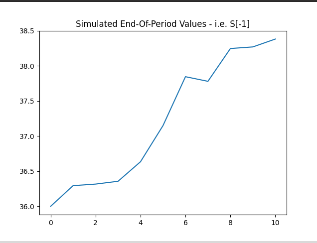

# Projects  
### Finance Projects  
Monte Carlo Simulation (using Numpy)  
  
Based on:  
Python for Finance - Yves Hilpisch

### CSV to MySQL database  
[tomysqlv2](https://github.com/arcelioeperez/csvtomysql)  

### CSV to JSON Converter (GUI using Tkinter)  
Steps to run  
1. Download the files (csvtojson and requirements.txt)  
2. Run the following commands  
```
pip3 install pandas
chmod +x csvtojson
./csvtojson
```  
Based on:  
[DataFish.com - Tutorial](https://datatofish.com/csv-to-json-string-python/)
